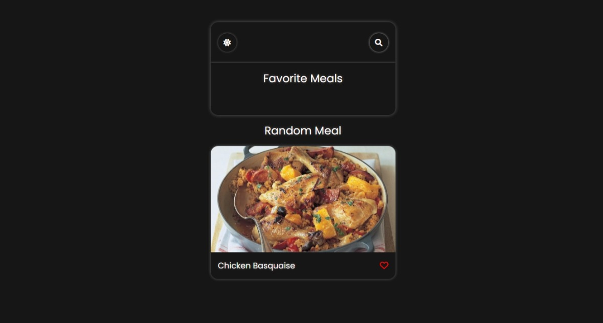

# ChefSource


The food app showing the recipe of any food using the themealdb API 🍕

## Demo

.

## Features

- Search for recipes based on different criteria, such as ingredients, meal types, or categories.
- View detailed recipe information, including ingredients, instructions, and images.
- Save favorite recipes for easy access later.
- Get random recipe suggestions for inspiration.
- Responsive design for seamless viewing on different devices.

## Technologies Used

- HTML
- CSS
- JavaScript
- themealdb API

  ## Installation

  Linux and macOS:

```bash
sudo git clone https://github.com/PrakasRavichandran/ChefSource.git
```

Windows:

```bash
git clone https://github.com/PrakasRavichandran/ChefSource.git
```

## Contact

If you want to contact me you can reach me at [Instagram](https://www.instagram.com/prakashravichandrann/).

## License

This project is **free to use** and does not contain any license.
